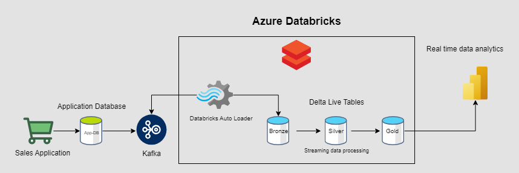

# README

## Motivador da escolha de uma fila Kafka para pedidos

O Kafka é uma plataforma de streaming de dados em tempo real, na qual os dados são lidos a partir de tópicos e podem ser processados imediatamente. Por isso, é ideal para casos em que a ingestão deve ocorrer de forma contínua e com baixa latência.

Como a principal stack de dados é o Databricks, que possui funcionalidades nativas para leitura de dados de uma fila Kafka, podemos utilizar o Auto Loader para ler os dados de pedidos a partir desses tópicos.

É necessário que a squad de pedidos configure o tópico em questão, gerencie os offsets e assegure que o consumo dos dados seja eficiente e seguro.

A partir disso, todo o processo de ingestão fica orquestrado e governado pelo Databricks. Esse processo deve ser configurado diretamente na plataforma, por meio da interface do Delta Live Tables. Neste repositório, há um código de exemplo para a ingestão dos dados.

Vale lembrar que é necessário apontar o seu pipeline no Delta Live Tables para um catálogo e um schema, onde as tabelas serão gravadas.
